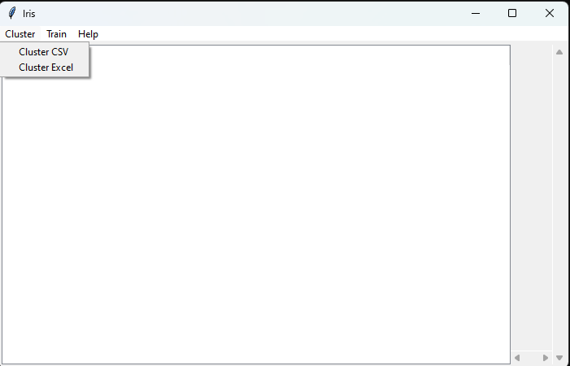
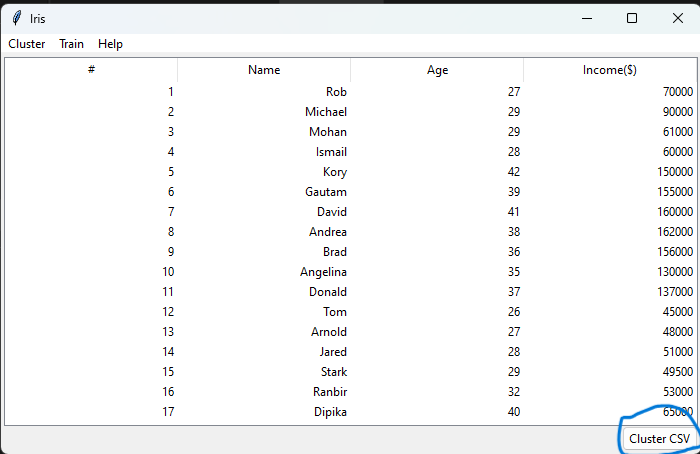
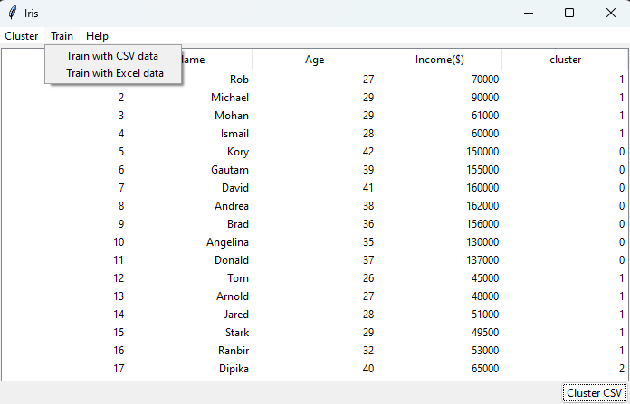

# Introduction
Welcome to Project Iris! This is a machine learning application developed as a school project. As a result, it currently has limited features.

# Features
The program allows data cleaning and clustering, which can then be used to train an AI model for classifying future unlabelled data.

## 1. Loading Excel and CSV Data
The application supports loading and displaying both Excel and CSV files in its main window.

To load data, go to the menu bar, select **Cluster**, and then choose the relevant submenu based on your data type.



## 2. Clustering the Data
If the data loads successfully, a **Cluster** button will appear at the bottom right of the screen.



Clicking this button opens a pop-up window where you can select columns containing **numerical values** for feature clustering. After selecting the appropriate columns, click **Done**.

## 3. Training the AI
To train the AI model, go to the menu, select **Train**, and choose the appropriate format depending on your data type.

The program will indicate whether the training was successful and display the model’s accuracy percentage. The ideal accuracy should be **90% or higher**.



---

# How to Set Up

Follow these steps to set up the project on your local machine.

## 1. Clone the Repository
```bash
git clone https://github.com/Boaz-Maroko/project-iris.git
cd project-iris
```

## 2. Create a Virtual Environment

### On Linux/macOS:
```bash
python3 -m venv venv
source venv/bin/activate
```

### On Windows:
```powershell
python -m venv venv
venv\Scripts\activate
```

## 3. Install Dependencies
```bash
pip install -r requirements.txt
```

## 4. Run the Application

### On Linux/macOS:
```bash
python3 -m GUI.main
```

### On Windows:
```powershell
py -m GUI.main
```

**OR**

You can download the executable version [here](https://github.com/Boaz-Maroko/project-iris/releases/tag/v1.0.0).
